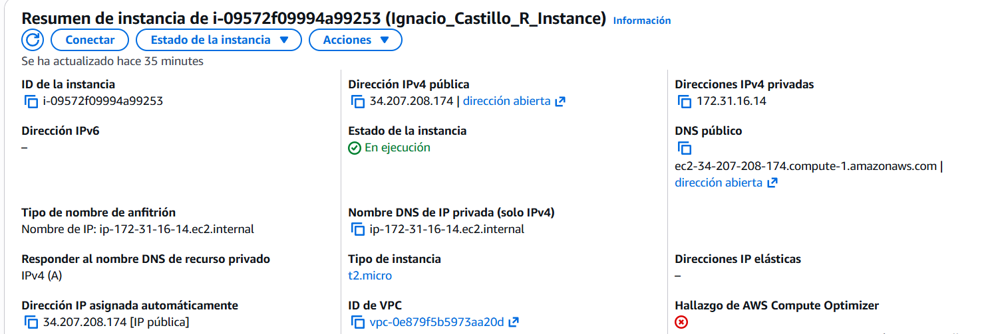
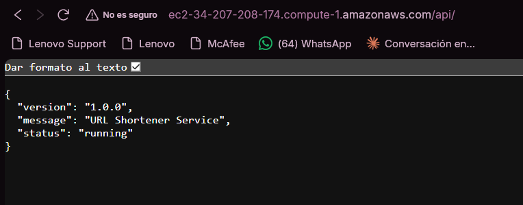
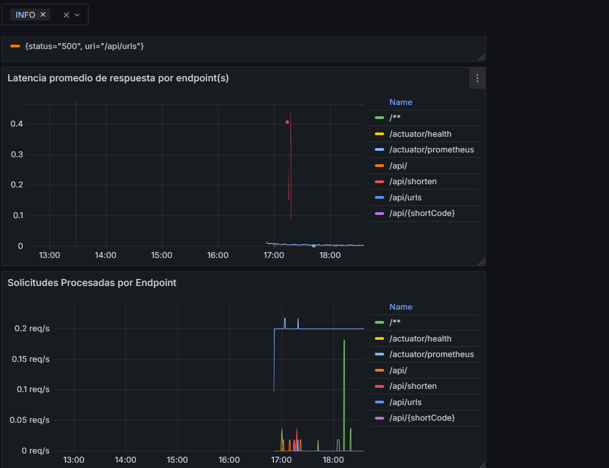
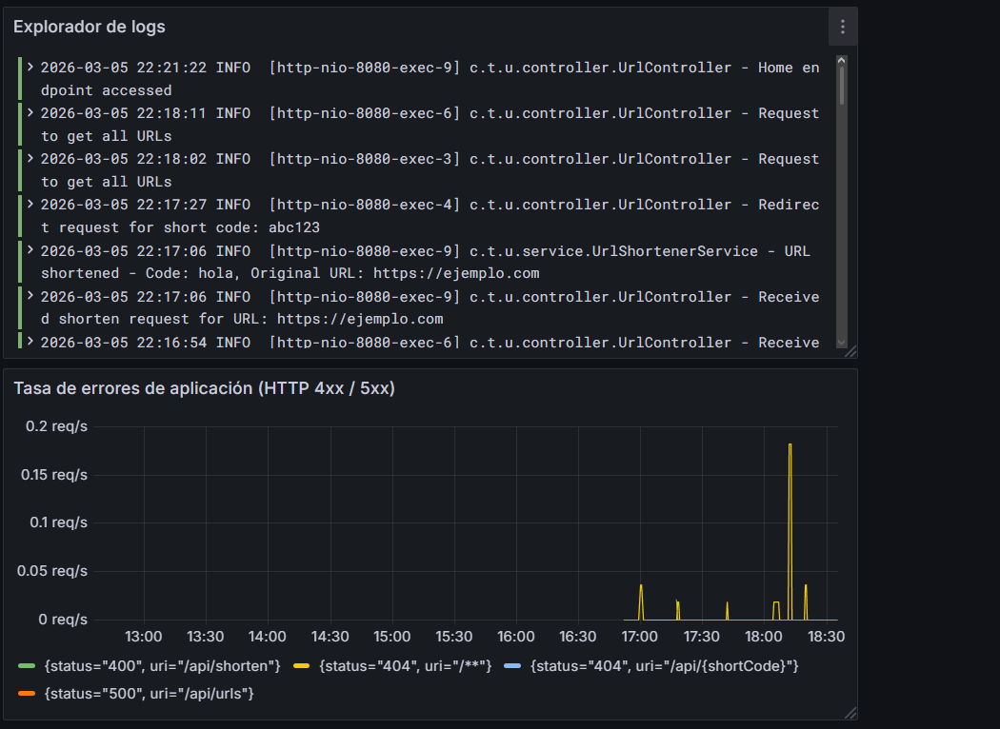
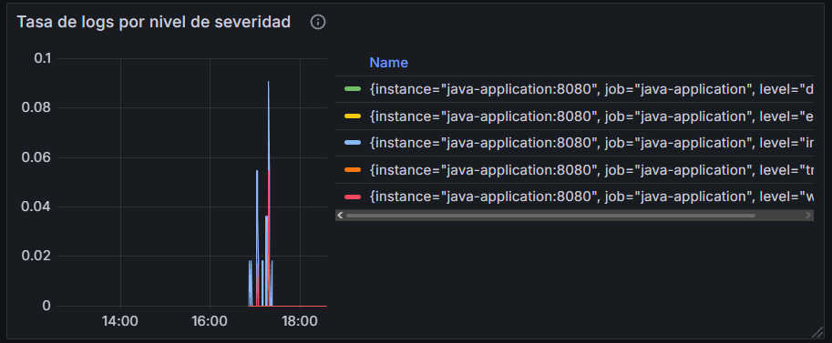
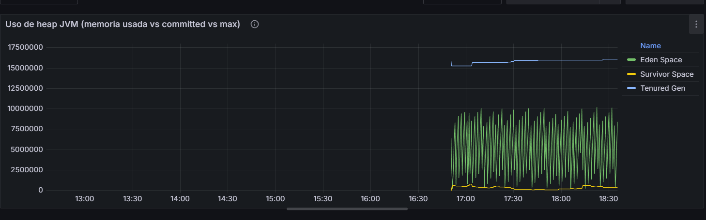
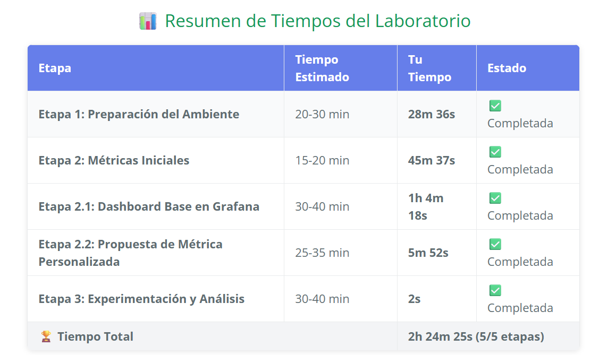

# Bitácora Experimento - Observabilidad y Monitoreo

**Nombre del estudiante:** Ignacio Andrés Castillo Rendón 
---

Cuando acabes no olvides ayudarnos evaluando tu ⭐[experiencia](https://forms.office.com/r/US1LARPmec)⭐

## Tabla de Contenidos
- [Etapa 1: Preparación del Ambiente](#etapa-1-preparación-del-ambiente)
- [Etapa 2: Métricas Iniciales](#etapa-2-métricas-iniciales)
- [Etapa 2.1: Dashboard Base en Grafana](#etapa-21-dashboard-base-en-grafana)
- [Etapa 2.2: Propuesta de Métrica Personalizada](#etapa-22-propuesta-de-métrica-personalizada)
- [Etapa 3: Experimentación y Análisis del Sistema](#etapa-3-experimentación-y-análisis-del-sistema)

---

## Etapa 1: Preparación del Ambiente

### 1.1. Información de la instancia EC2

### 1.2. Verificación del despliegue

**¿La aplicación se desplegó correctamente?** 

- [X] Sí
- [ ] No

**Captura de pantalla de la aplicación funcionando:**






### 1.3. Observaciones y problemas encontrados (opcional)
```


```

---

## Etapa 2: Métricas Iniciales

### 2.0.1. Generación de tráfico

**Endpoints probados:**

- [X] `GET /api/`
- [X] `POST /api/shorten`
- [X] `GET /api/{shortCode}`
- [X] `GET /api/urls`


### 2.0.2. Análisis de dos métricas relevantes

#### Métrica 1

**Nombre de la métrica:**  
```
TYPE logback_events_total
```

**Tipo de métrica:** 
- [X] Counter
- [ ] Gauge 
- [ ] Histogram 
- [ ] Summary

**Descripción de qué información aporta:**
```
La métrica counter es una de las métricas que solo pueden incrementar, o reiniciarse a cero si el proceso se reinicia. Lo que representa son acumulaciones totales a lo largo del tiempo. Es decir, cuánto ha ocurrido desde que arrancó la aplicación.

De lo que se pudo ver en /actuator/prometheus bajo la métrica TYPE logback_events_total:
- Se han logueado 24 eventos del nivel INFO
- Hubo 4 warnings desde el arranque
- 3 errores registrados
- 0 trazas registradas
- 0 debugs regitrados

```

**Relación con otras métricas (si aplica):**
```
http_server_requests_seconds_count (Counter) + http_server_requests_seconds_max (Gauge)
Las requests fallidas tardaron 5x más que las exitosas. El Counter dice cuántas, el Gauge dice qué tan lento fue el peor caso.

logback_events_total{level="error"} = 3 (Counter) + http_server_requests con status 500 (Counter)

Hay más errores logueados (3) que errores HTTP (1), quiere decir que, algunos errores ocurrieron internamente sin llegar a responder un 500, o el mismo error se loguea múltiples veces.


```

**¿En que escenarios puede ayudar esta métrica?**
```
Esta métrica sirve para casos por ejemplos para la detección de errores temprano (con error); para hacer una validación post-deploy (error and warn); correlación con errores http, como errores 500s (error), entre otros


```

**¿Qué etiquetas (labels) se utilizan para agrupar los datos?**
```
La etiqueta para esta métrica es level y sus valores posibles (INFO, ERROR, WARN, TRACE, DEBUG) son los niveles estándares de Logback/SLF4J


```

---

#### Métrica 2

**Nombre de la métrica:**  
```
TYPE jvm_threads_states_threads gauge
```

**Tipo de métrica:** 
- [ ] Counter
- [X] Gauge 
- [ ] Histogram 
- [ ] Summary

**Descripción de qué información aporta:**
```
Los estados de los hilos corriendo de la aplicación


```

**Relación con otras métricas (si aplica):**
```
Uso de CPU con otra métrica gauge según los estados de los hilos


```

**¿En que escenarios puede ayudar esta métrica?**
```
Ver como van los procesos utilizados mediante los hilos de la aplicación.


```

**¿Qué etiquetas (labels) se utilizan para agrupar los datos?**
```
La etiqueta para esta métrica es level y sus valores posibles (INFO, ERROR, WARN, TRACE, DEBUG) son los niveles estándares de Logback/SLF4J


```

---

## Etapa 2.1: Dashboard Base en Grafana


### 2.1.1. Evidencia: Dashboard Base en Grafana con los 4 paneles iniciales

**Captura de pantalla del dashboard:**




### 2.1.2. Visualizaciónes Adicionales (Con las metricas actuales)

#### Visualización Adicional 1

**Propósito:**
```
Los paneles actuales muestran qué pasa en la capa HTTP, pero no qué pasa internamente en la app. Este panel complementa el de errores HTTP — recuerda que tienes error=3 en logs pero solo status=500 count de 1, entonces este panel haría visible esa diferencia.


```

**Título del panel:**
```
Tasa de logs por nivel de severidad
```

**Consulta (PromQL o LogQL):**
```
rate(logback_events_total[1m])

```

**Tipo de visualización:** 
- [X] Time series
- [ ] Gauge
- [ ] Bar chart
- [ ] Stat
- [ ] Logs
- [ ] Otro: _____

**Otros ajustes aplicados (colores, unidades, etc.) (opcional):**
```
Ninguna

```

**Captura de pantalla:**



**Análisis (2-3 frases):**
```
Hay 2 errores silenciosos que la app está tragándose internamente — probablemente en algún bloque try/catch que loguea pero no propaga el error al cliente. Eso es potencialmente peligroso porque el usuario no se entera pero algo sí está fallando.

El patrón de info=24 con solo ~28 minutos de uptime (1701s) sugiere que la mayoría de esos logs son del arranque, no de operación continua.


```

---

#### Visualización Adicional 2

**Propósito:**
```
El heap está dividido en Eden Space, Survivor Space y Tenured Gen, y con tus paneles HTTP actuales no tienes visibilidad de recursos del servidor. Si el heap se llena, empezarás a ver más GC pauses y eventualmente errores 500 — conecta directamente con el panel de errores que ya tienes.


```

**Título del panel:**
```
Uso de heap JVM (memoria usada vs committed vs max)
```

**Consulta (PromQL o LogQL):**
```
sum by (id) (jvm_memory_used_bytes{area="heap"})

```

**Tipo de visualización:** 
- [X] Time series
- [ ] Gauge
- [ ] Bar chart
- [ ] Stat
- [ ] Logs
- [ ] Otro: _____

**Otros ajustes aplicados (colores, unidades, etc.) (opcional):**
```


```

**Captura de pantalla:**



**Análisis (2-3 frases):**
```
El patrón indica una tormenta de asignaciones durante el arranque de Spring que ya se estabilizó. Con solo 1 CPU disponible (system_cpu_count=1), esos 18 GC menores habrían causado pequeñas pausas perceptibles en los primeros requests.


```

---

### 2.1.3. Análisis final del dashboard

**¿Qué otros datos te gustaría visualizar si tuvieras más información disponible?**
```
- El error 500 en /api/urls y los 2 errores silenciosos en log casi con certeza tienen origen en la capa de persistencia. Con un URL shortener, la BD es el componente crítico y actualmente es un punto ciego total.
- Un URL shortener en producción debería tener caché para los shortCodes más consultados

```

---

## Etapa 2.2: Propuesta de Métrica Personalizada


### 2.2.1. Análisis y propuesta de la métrica propia (en Java)

**1. Nombre de la métrica:**
```
Ejemplo: url_shortener_urls_created_total

```

**2. Tipo de métrica:**
- [ ] Counter
- [ ] Gauge

**3. ¿Qué comportamiento mide?**
```


```

**4. ¿Por qué es relevante para el sistema?**
```


```

---


### 2.2.3. Visualización en Grafana

**1. ¿Qué tipo de panel usaste en Grafana?**

- [ ] Time series  
- [ ] Gauge  
- [ ] Stat  
- [ ] Bar chart  
- [ ] Otro: _____

**2. ¿Qué consulta PromQL vas a utilizar?**
```promql


```

**3. ¿Cuál es el propósito de la visualización?**
```
Provee una interpretación en palabras con el propósito de la visualización. Que te interesa ver en el panel?


```


---

### 2.2.4. Panel creado en Grafana

**Captura de pantalla del panel en Grafana:**

> _[Inserta aquí la imagen del panel mostrando la métrica visualizada]_

---

## Etapa 3: Experimentación y Análisis del Sistema

### 3.1. Detección de anomalías y puntos de interés

**1. Como describirias la anomalía?**

```


```

**2. Que paneles te ayudaron a identificarlo?**

``` 


```

**3. Cual podria ser la causa de la anomalía?**

``` 


```

**Captura de pantalla del dashboard mostrando la anomalía:**

> _[Inserta aquí la imagen]_

---

### 3.2. Intento de corrección de anomalías


#### 3.2.1. Modificación del código

**Descripción del ajuste realizado:**
```
Describe en pocas palabras el ajuste realizado.


```

#### 3.2.2. Resultados después del despliegue

**¿El ajuste surtió efecto?**
- [ ] Sí 
- [ ] No 
- [ ] Parcialmente


**Captura de pantalla del dashboard después del ajuste:**

> _[Inserta aquí la imagen del estado del dashboard posterior al ajuste]_

---

### 5.7. Reflexión final

**¿Qué panel te resultó más útil para detectar problemas?**
```


```

**¿Qué métrica aporta mayor valor para monitorear un sistema real?**
```


```

**¿Qué agregarías o mejorarías en tu dashboard?**
```


```



No se completó la 2.2 y la etapa 3

**Fin de la bitácora**
